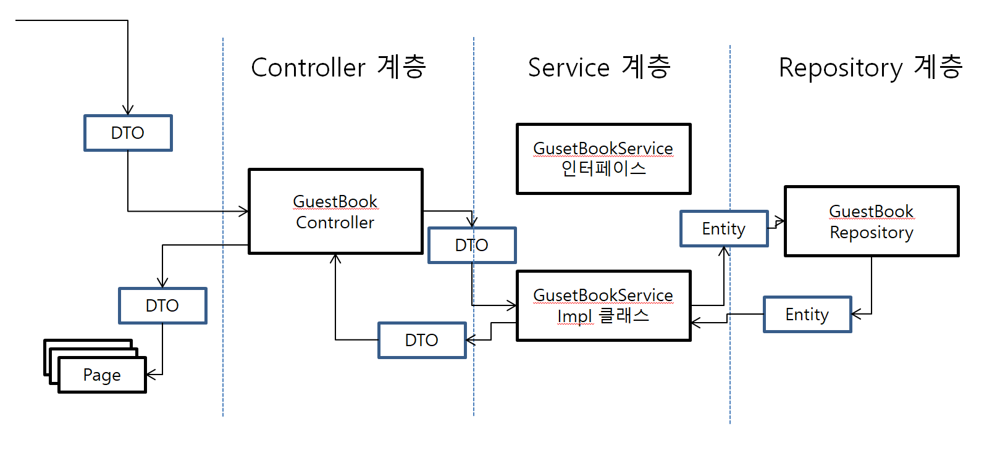
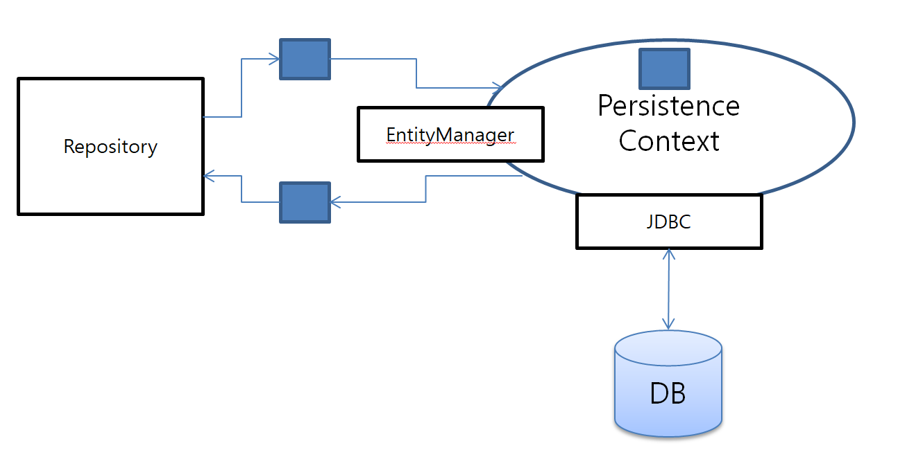

# Part2 Spring MVC/JPA/Thymeleaf 연습(방명록 구현)

## 환경
* Spring boot : 2.6.4
  * Thymeleaf(동적 화면 구성)
  * lombok(어노테이션 기반 코드 다이어트 라이브러리)
  * Spring Data JPA(자바 진영의 ORM 표준 인터페이스 모음)
  * Spring Web(Embedded WAS 등 웹 구현에 필요한 라이브러리 모음)
  * Spring Boot DevTools(boot 개발 편의를 위한 모듈)  
* DB : mariaDB 10

## 프로젝트 구조
* 구현할 URL
  
  |기능|URL|GET/POST|기능|
  |------|---|---|---|
  |목록|/guestbook/list|GET|목록/페이징/검색|
  |등록|/guestbook/register|GET|입력 화면|
  |등록|/guestbook/register|POST|등록 처리|
  |조회|/guestbook/read|GET|조회 화면|
  |수정|/guestbook/modify|GET|수정/삭제 가능 화면|
  |수정|/guestbook/modify|POST|수정 처리|
  |삭제|/guestbook/remove|POST|삭제 처리|

* 수정/삭제 시 POST 를 사용하는 이유?
  * POST 요청 : 서버에서 보낸 데이터를 대상 리소스가 처리하도록 하는 요청의 의미도 있음
  * Method 에는 POST 를 채용하고, URI 에 action 을 하는 형태로도 사용한다
  
* 계층 구분



* 계층을 나누는 이유
  * MVC 패턴(Model, View, Controller)
  * Controller : 요청/응답 담당
  * Service : 요청/응답에 대해서 로직 처리와 data 계층을 이어주는 레이어
  * Repository : Data 처리 담당 레이어
  * 컨트롤러는 서비스를 여러개 사용할 수 있고, 서비스는 Repository 를 여러개 사용할 수 있다(코드 중복 제거)

* DTO 를 사용하는 이유
  * view 단에서 Domain 을 사용하게 되면 불필요한 정보가 노출 될 수 있음 
  * 뷰의 요구사항 변화로 Domain 클래스를 변경하지 않을 수 있음
  
## JPA(Java Persistence API)
* ORM(Object Relation Mapping)
  * 테이블 <-> 클래스가 유사한 부분이 있음(회원, 주소.. )
  * RDBMS <-> 객체 간 변환을 지원함

* JPA
  * ORM 을 Java 언어에 맞게 사용하기 위한 스펙, ORM 의 하위 개념
  * 아래와 같은 구조
    
  
  
  * 특징
    * Entity Manager
      * Entity를 저장하고 수정하고 삭제하고 조회하는 등 Entity와 관련된 모든일을 수행
      * Thread-Safe 하지 않음 멀티쓰레드 환경에서, EntityManagerFactory 를 통해 EntityManager 가 만들어진다
    * Persistence Context  
      * Entity 를 영구 저장하는 환경, DB 에 바로 접근하지 않고 해당 컨텍스트에 엔티티가 보관된다
      * 어플리케이션과 DB 사이에서 객체를 보관하는 가상의 DB 환경과 같은 역할
      * 사용 이유
        1. 1차 캐시 역할 : 조회 시, 먼저 Persistence Context 에 조회한 후 없으면 DB 조회
        2. 객체 동일성 보장 : 같은 ID 를 가진 객체가 동일한 인스턴스를 보장
        3. 트랜잭션 지원하는 쓰기 지연 
        4. 변경 감지 : 엔티티 변화를 자동으로 감지한 후 DB 에 반영

## QueryDSL 라이브러리
  * 사용 이유 
    1. 문자가 아닌 코드로 쿼리를 작성함으로써, 컴파일 시점에 문법 오류를 쉽게 확인할 수 있다.
    2. 자동 완성 등 IDE의 도움을 받을 수 있다. 
    3. 동적인 쿼리 작성이 편리하다
  
  * QueryDSL 사용 예
  
  ```java
  //검색 조건을 작성하기
          BooleanBuilder conditionBuilder = new BooleanBuilder();
  
          if(type.contains("t")){
          conditionBuilder.or(qGuestbook.title.contains(keyword));
          }
          if(type.contains("c")){
          conditionBuilder.or(qGuestbook.content.contains(keyword));
          }
          if(type.contains("w")){
          conditionBuilder.or(qGuestbook.writer.contains(keyword));
          }
  
          //모든 조건 통합
          booleanBuilder.and(conditionBuilder);
  ```

## 백엔드 구현 내용 설명
### Entity 클래스
* BaseEntity(시간, 등록일자를 재사용하기 위한 Abstract 클래스)
  ```java
  @MappedSuperclass
  @EntityListeners(value = { AuditingEntityListener.class })
  @Getter
  abstract class BaseEntity {
  
      @CreatedDate
      @Column(name = "regdate", updatable = false)
      private LocalDateTime regDate;
  
      @LastModifiedDate
      @Column(name ="moddate" )
      private LocalDateTime modDate;
  
  }
  ```
  * AuditingEntityListener : Data JPA에서 해당 클래스를 상속받은 Entity 의 생성/변경 감지한 후 적절한 값을 알아서 넣어주겠다
  * @MappedSuperClass 어노테이션을 선언하면, 테이블이 생성되지 않게 된다
  * @MappedSuperClass 어노테이션이 없다면, 테이블을 만드는 것인지(?)
  

* GuestBook 클래스
  ```java
  @Entity
  @Getter
  @Builder
  @AllArgsConstructor
  @NoArgsConstructor
  @ToString
  public class Guestbook extends BaseEntity {
  
      @Id
      @GeneratedValue(strategy = GenerationType.IDENTITY)
      private Long gno;
  
      @Column(length = 100, nullable = false)
      private String title;
  
      @Column(length = 1500, nullable = false)
      private String content;
  
      @Column(length = 50, nullable = false)
      private String writer;
  
      public void changeTitle(String title){
          this.title = title;
      }
  
      public void changeContent(String content){
          this.content = content;
      }
  }
  ```
  * @Entity : 데이터베이스의 테이블과 1:1 로 매칭되는 클래스를 뜻함
  * @GeneratedValue(strategy = GenerationType.IDENTITY) : ID 자동 생성(DB에 맡김)

## Repository 클래스
* GuestbookRepository
  ```java
  public interface GuestbookRepository extends JpaRepository<Guestbook, Long>, QuerydslPredicateExecutor<Guestbook> {
  }
  ```
  * Spring 이 자동으로 인터페이스에 맞는 객체를 생성해서 Bean 에 등록하므로, interface 만 존재함
  
## Service 클래스
* GuestbookService
  ```java
  public interface GuestbookService {
  
      Long register(GuestbookDTO dto);
  
      PageResultDTO<GuestbookDTO, Guestbook> getList(PageRequestDTO requestDTO);
  
      GuestbookDTO read(Long gno);
  
      void modify(GuestbookDTO dto);
  
      void remove(Long gno);
  
      default Guestbook dtoToEntity(GuestbookDTO dto) {
          Guestbook entity = Guestbook.builder()
                  .gno(dto.getGno())
                  .title(dto.getTitle())
                  .content(dto.getContent())
                  .writer(dto.getWriter())
                  .build();
          return entity;
      }
  
      default GuestbookDTO entityToDto(Guestbook entity){
  
          GuestbookDTO dto  = GuestbookDTO.builder()
                  .gno(entity.getGno())
                  .title(entity.getTitle())
                  .content(entity.getContent())
                  .writer(entity.getWriter())
                  .regDate(entity.getRegDate())
                  .modDate(entity.getModDate())
                  .build();
  
          return dto;
      }
  }
  ```
  
* GuestbookServiceImpl
  ```java
  @Service
  @Log4j2
  @RequiredArgsConstructor
  public class GuestbookServiceImpl implements GuestbookService {
  
      private final GuestbookRepository repository;
  
      @Override
      public Long register(GuestbookDTO dto) {
  
          log.info("DTO------------------------");
          log.info(dto);
  
          Guestbook entity = dtoToEntity(dto);
  
          log.info(entity);
  
          repository.save(entity);
  
          return entity.getGno();
      }
  
      @Override
      public PageResultDTO<GuestbookDTO, Guestbook> getList(PageRequestDTO requestDTO) {
  
          Pageable pageable = requestDTO.getPageable(Sort.by("gno").descending());
  
          BooleanBuilder booleanBuilder = getSearch(requestDTO); //검색 조건 처리
  
          Page<Guestbook> result = repository.findAll(booleanBuilder, pageable); //Querydsl 사용
  
          Function<Guestbook, GuestbookDTO> fn = (entity -> entityToDto(entity));
  
          return new PageResultDTO<>(result, fn );
      }
  
      @Override
      public GuestbookDTO read(Long gno) {
  
          Optional<Guestbook> result = repository.findById(gno);
  
          return result.isPresent()? entityToDto(result.get()): null;
      }
  
      @Override
      public void remove(Long gno) {
  
          repository.deleteById(gno);
  
      }
  
      @Override
      public void modify(GuestbookDTO dto) {
  
          //업데이트 하는 항목은 '제목', '내용'
  
          Optional<Guestbook> result = repository.findById(dto.getGno());
  
          if(result.isPresent()){
  
              Guestbook entity = result.get();
  
              entity.changeTitle(dto.getTitle());
              entity.changeContent(dto.getContent());
  
              repository.save(entity);
  
          }
      }
  
      private BooleanBuilder getSearch(PageRequestDTO requestDTO){
  
          String type = requestDTO.getType();
  
          BooleanBuilder booleanBuilder = new BooleanBuilder();
  
          QGuestbook qGuestbook = QGuestbook.guestbook;
  
          String keyword = requestDTO.getKeyword();
  
          BooleanExpression expression = qGuestbook.gno.gt(0L); // gno > 0 조건만 생성
  
          booleanBuilder.and(expression);
  
          if(type == null || type.trim().length() == 0){ //검색 조건이 없는 경우
              return booleanBuilder;
          }
  
  
          //검색 조건을 작성하기
          BooleanBuilder conditionBuilder = new BooleanBuilder();
  
          if(type.contains("t")){
              conditionBuilder.or(qGuestbook.title.contains(keyword));
          }
          if(type.contains("c")){
              conditionBuilder.or(qGuestbook.content.contains(keyword));
          }
          if(type.contains("w")){
              conditionBuilder.or(qGuestbook.writer.contains(keyword));
          }
  
          //모든 조건 통합
          booleanBuilder.and(conditionBuilder);
  
          return booleanBuilder;
      }
  }
  
  ```
    * @Service : Service 클래스를 명시, Bean 객체가 생성되어 등록

## 컨트롤러
* GuestBookController
  ```java
  @Controller
  @RequestMapping("/guestbook")
  @Log4j2
  @RequiredArgsConstructor
  public class GuestBookController {
  
      private final GuestbookService service; //final로 선언
  
      @GetMapping("/")
      public String index() {
  
          return "redirect:/guestbook/list";
      }
  
  
      @GetMapping("/list")
      public void list(PageRequestDTO pageRequestDTO, Model model){
  
          log.info("list............." + pageRequestDTO);
  
          model.addAttribute("result", service.getList(pageRequestDTO));
  
      }
  
      @GetMapping("/register")
      public void register(){
          log.info("regiser get...");
      }
  
      @PostMapping("/register")
      public String registerPost(GuestbookDTO dto, RedirectAttributes redirectAttributes){
  
          log.info("dto..." + dto);
  
          //새로 추가된 엔티티의 번호
          Long gno = service.register(dto);
  
          redirectAttributes.addFlashAttribute("msg", gno);
  
          return "redirect:/guestbook/list";
      }
  
      @GetMapping({"/read", "/modify"})
      public void read(long gno, @ModelAttribute("requestDTO") PageRequestDTO requestDTO, Model model ){
  
          log.info("gno: " + gno);
  
          GuestbookDTO dto = service.read(gno);
  
          model.addAttribute("dto", dto);
  
      }
  
      @PostMapping("/remove")
      public String remove(long gno, RedirectAttributes redirectAttributes){
  
  
          log.info("gno: " + gno);
  
          service.remove(gno);
  
          redirectAttributes.addFlashAttribute("msg", gno);
  
          return "redirect:/guestbook/list";
  
      }
  
      @PostMapping("/modify")
      public String modify(GuestbookDTO dto,
                           @ModelAttribute("requestDTO") PageRequestDTO requestDTO,
                           RedirectAttributes redirectAttributes){
  
  
          log.info("post modify.........................................");
          log.info("dto: " + dto);
  
          service.modify(dto);
  
          redirectAttributes.addAttribute("page",requestDTO.getPage());
          redirectAttributes.addAttribute("type",requestDTO.getType());
          redirectAttributes.addAttribute("keyword",requestDTO.getKeyword());
  
          redirectAttributes.addAttribute("gno",dto.getGno());
  
  
          return "redirect:/guestbook/read";
  
      }
  }
  ```
  * @Controller : Controller 클래스를 명시, Bean 객체가 생성되어 등록

## DTO 
* GuestbookDTO
  ```java
  @Builder
  @NoArgsConstructor
  @AllArgsConstructor
  @Data
  public class GuestbookDTO {
  
      private Long gno;
      private String title;
      private String content;
      private String writer;
      private LocalDateTime regDate, modDate;
  }
  ```
  * @Data : @Getter, @Setter, @ToString, @EqualsAndHashCode, @RequiredArgsConstructor
  
* PageRequestDTO
  ```java
  @Builder
  @AllArgsConstructor
  @Data
  public class PageRequestDTO {
  
      private int page;
      private int size;
      private String type;
      private String keyword;
  
  
      public PageRequestDTO(){
          this.page = 1;
          this.size = 10;
      }
  
      public Pageable getPageable(Sort sort){
  
          return PageRequest.of(page -1, size, sort);
  
      }
  }
  ```

* PageResultDTO
  ```java
  @Data
  public class PageResultDTO<DTO, EN> {
  
      //DTO리스트
      private List<DTO> dtoList;
  
      //총 페이지 번호
      private int totalPage;
  
      //현재 페이지 번호
      private int page;
      //목록 사이즈
      private int size;
  
      //시작 페이지 번호, 끝 페이지 번호
      private int start, end;
  
      //이전, 다음
      private boolean prev, next;
  
      //페이지 번호  목록
      private List<Integer> pageList;
  
      public PageResultDTO(Page<EN> result, Function<EN,DTO> fn ){
  
          dtoList = result.stream().map(fn).collect(Collectors.toList());
  
          totalPage = result.getTotalPages();
  
          makePageList(result.getPageable());
      }
  
  
      private void makePageList(Pageable pageable){
  
          this.page = pageable.getPageNumber() + 1; // 0부터 시작하므로 1을 추가
          this.size = pageable.getPageSize();
  
          //temp end page
          int tempEnd = (int)(Math.ceil(page/10.0)) * 10;
  
          start = tempEnd - 9;
  
          prev = start > 1;
  
          end = totalPage > tempEnd ? tempEnd: totalPage;
  
          next = totalPage > tempEnd;
  
          pageList = IntStream.rangeClosed(start, end).boxed().collect(Collectors.toList());
  
      }
  
  }
  ```

## 방명록 리스트 가져오기
* 방명록 리스트를 가져오기 위해서는, 아래와 같은 조건이 필요하다
  1. 페이지 네비게이션 정보
  2. 검색 조건 및 키워드

* 리스트 가져오기 소스(GuestbookServiceImpl)
```java
  @Override
    public PageResultDTO<GuestbookDTO, Guestbook> getList(PageRequestDTO requestDTO) {

        //정렬은 gno 내림차순이고, PageRequestDTO 내부의 페이지 번호와 출력 갯수를 통해 Pageable 객체를 생성한다
        Pageable pageable = requestDTO.getPageable(Sort.by("gno").descending());

        //requestDTO 의 파라미터와 QueryDSL 을 통해, 검색 조건을 생성한다
        BooleanBuilder booleanBuilder = getSearch(requestDTO);

        //repository 에처 해당 조건 및 페이징 정보를 통해 결과를 가져온다
        Page<Guestbook> result = repository.findAll(booleanBuilder, pageable);

        //entity 를 DTO 로 매칭시키는 함수를 정의
        Function<Guestbook, GuestbookDTO> fn = (entity -> entityToDto(entity));

        //페이징 결과와 함께 리턴
        return new PageResultDTO<>(result, fn );
    }

  private BooleanBuilder getSearch(PageRequestDTO requestDTO){
        //페이지에서 요청한 검색 타입을 가져온다
        String type = requestDTO.getType();

        BooleanBuilder booleanBuilder = new BooleanBuilder();

        //QueryDSL 사용을 위한 qGuestbook 객체를 가져온다
        QGuestbook qGuestbook = QGuestbook.guestbook;

        String keyword = requestDTO.getKeyword();

        BooleanExpression expression = qGuestbook.gno.gt(0L); // gno > 0 조건만 생성

        booleanBuilder.and(expression);

        if(type == null || type.trim().length() == 0){ //검색 조건이 없는 경우
        return booleanBuilder;
        }


        //검색 조건을 작성
        BooleanBuilder conditionBuilder = new BooleanBuilder();

        //제목
        if(type.contains("t")){
        conditionBuilder.or(qGuestbook.title.contains(keyword));
        }
        //본문
        if(type.contains("c")){
        conditionBuilder.or(qGuestbook.content.contains(keyword));
        }
        //작성자
        if(type.contains("w")){
        conditionBuilder.or(qGuestbook.writer.contains(keyword));
        }

        //모든 조건 통합
        booleanBuilder.and(conditionBuilder);

        return booleanBuilder;
  }    
```

## 방명록 생성
* 방명록 생성은, View 단에서 온 PageRequestDTO 를 통해 생성한다
* 생성 소스(GuestbookServiceImpl)
  ```java
      @Override
      public Long register(GuestbookDTO dto) {
  
          log.info("DTO------------------------");
          log.info(dto);
  
          Guestbook entity = dtoToEntity(dto);
  
          log.info(entity);
  
          repository.save(entity);
  
          return entity.getGno();
      }
  ```

## 방명록 조회
* 조회는 단순히, 방명록의 id 값을 통해 질의한다
* 조회 소스(GuestbookServiceImpl)
  ```java
  @Override
      public GuestbookDTO read(Long gno) {
  
          Optional<Guestbook> result = repository.findById(gno);
  
          return result.isPresent()? entityToDto(result.get()): null;
      }
  ```

## 방명록 수정
* 수정은 제목, 내용만 수정할 수 있다
* 수정 소스(GuestbookServiceImpl)
  ```java
  @Override
  public void modify(GuestbookDTO dto) {
  
          //먼저 해당 id 가 존재하는지 확인
          Optional<Guestbook> result = repository.findById(dto.getGno());
  
          //수정할 목록이 있을 경우 수정한다
          if(result.isPresent()){
  
          Guestbook entity = result.get();
  
          entity.changeTitle(dto.getTitle());
          entity.changeContent(dto.getContent());
  
          repository.save(entity);
  
          }
  }
  ```
  
## 방명록 삭제
* 방명록 삭제는 방명록의 ID 를 받아서 삭제한다
* 수정 소스(GuestbookServiceImpl)
  ```java
      @Override
      public void remove(Long gno) {
  
          repository.deleteById(gno);
  
      }
  ```
  
